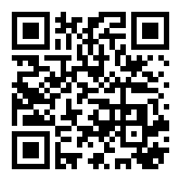

## Get Started

### Quick Preview

Use Browser or Quick Application Debugger (Android app) to scan the code to preview the component library effect.

<div style="text-align: center;margin: 40px;"></div>

### Using the Component Library

Use either of the following methods to install component libraries to project dependencies:

```sh
npm install qui --save  # Use npm
yarn add qui            # Use yarn
```

The component library is developed using less, so you need to install the corresponding dependency.

```shell script
npm install less less-loader --save-dev
` ` `

::: Danger Strong Prompt
The component library designWidth is developed based on 360-degree. To adapt to different designWidths, you need to modify the @ratio variable in the `qaui/src/components/common.less` file.

The default @ratio value of the current component library is 750/360. If the designWidth value of your app is 360, change @ratio to 360/360.
::

### Feedback Communication

If you have any problems using the component library, please contact us at `github`.

```
