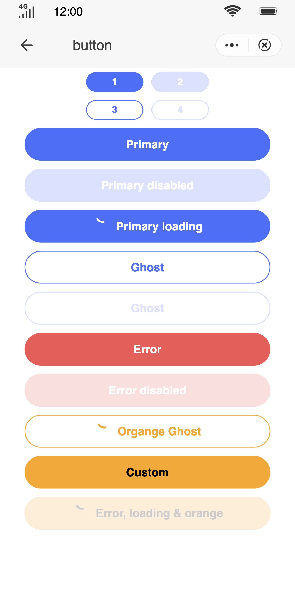

## Button (`button`)

### Description

Basic component for buttons.

### Usage result

<!--div style="text-align: center;margin: 40px;"></div -->

<preview url="https://wonderful-harsh-alvarezsaurus.glitch.me/preview/pages/button"/>

### How to use it

Importing a component in a `.ux` file:

```html
<import name="q-button" src="qaui/src/components/button/index"></import>
```

### Example

```html
<template>
  <div class="qui-wrap">
    <div class="inline">
      <q-button class="button" type="primary" size="small">Primary</q-button>
      <q-button class="button" type="primary" size="small" disabled="{{true}}"
        >Primary</q-button
      >
    </div>
    <div class="inline">
      <q-button class="button" type="ghost" size="small">Ghost</q-button>
      <q-button class="button" type="ghost" size="small" disabled="{{true}}"
        >Ghost</q-button
      >
    </div>
    <q-button class="button" type="primary">Primary</q-button>
    <q-button class="button" type="primary" disabled="{{true}}"
      >Primary disabled</q-button
    >
    <q-button class="button" type="primary" loading="{{true}}"
      >Primary loading</q-button
    >

    <q-button class="button" type="ghost">Ghost</q-button>
    <q-button class="button" type="ghost" color="orange" loading="{{true}}"
      >Custom color</q-button
    >
    <q-button class="button" type="ghost" disabled="{{true}}"
      >Ghost disabled</q-button
    >

    <q-button class="button" type="error">Error</q-button>
    <q-button class="button" type="error" disabled="{{true}}"
      >Error disabled</q-button
    >

    <q-button class="button" bg-color="orange" color="#000"
      >Custom color</q-button
    >
    <q-button
      class="button"
      type="error"
      loading="{{true}}"
      bg-color="orange"
      color="#000"
      disabled="{{true}}"
      >Customized</q-button
    >
  </div>
</template>
```

```less
.qui-wrap {
  flex-direction: column;
  align-items: center;
  .button {
    margin: 5px;
  }
}
```

### API

#### Component Properties

| Attribute  | Type    | Value by default | Description                                                                |
| ---------- | ------- | ---------------- | -------------------------------------------------------------------------- |
| `type`     | String  | `'primary'`      | Button type. The options are as follows: `'primary'`\|`'ghost'`\|`'error'` |
| `size`     | String  | `'normal'`       | Button size. The options are as follows: `'normal'`\|`'small'`             |
| `loading`  | Boolean | `false`          | Whether the button is being loaded or not                                  |
| `disabled` | Boolean | `false`          | Whether the button is disabled or not                                      |
| `bgColor`  | String  | `''`             | Button background color                                                    |
| `color`    | String  | `''`             | Button color (including text and border)                                   |
| `width`    | Number  | `''`             | Button width                                                               |

#### Component Events

| Event name | Event description | Value returned |
| ---------- | ----------------- | -------------- |
| `tap`      | Click of button   | -              |
