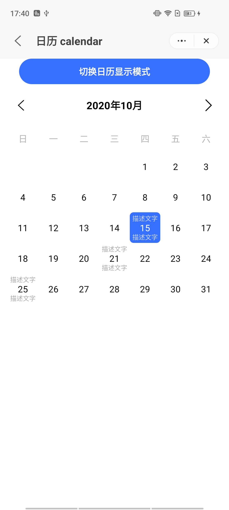
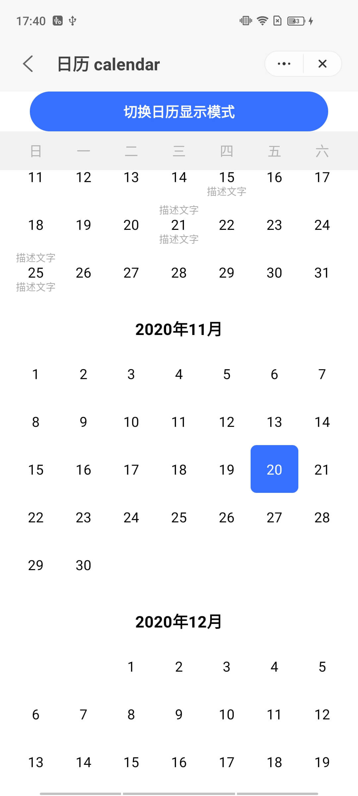

## Calendar (`calendar`)

### Description

Component to view and select dates.

### Usage result

<div style="text-align: center;margin: 40px;">
    
    
</div>

### How to use it

Importing a component in a `.ux` file:

```html
<import name="q-calendar" src="qaui/src/components/calendar/index"></import>
```

### Example

```html
<template>
  <div class="qaui-wrap">
    <q-button ontap="changeType">Toggle Calendar Display Mode</q-button>
    <q-calendar
      if="type==='default'"
      type="default"
      description="{{desc}}"
    ></q-calendar>
    <q-calendar
      if="type==='list'"
      type="list"
      description="{{desc}}"
    ></q-calendar>
  </div>
</template>
```

```js
export default {
  data() {
    return {
      type: 'default',
      desc: [
        {
          date: '2020-10-15',
          top: 'Description Text',
          bottom: 'Description Text',
        },
        {
          date: '2020-10-21',
          top: 'Description Text',
          bottom: 'Description Text',
        },
      ],
    }
  },
  changeType() {
    this.type === 'default' ? (this.type = 'list') : (this.type = 'default')
    console.log(this.type)
  },
}
```

```less
.qui-wrap {
  flex-direction: column;
  align-items: center;
}
```

### API

#### Component Properties

| Attribute     | Type   | Value by default        | Description                                                  |
| ------------- | ------ | ----------------------- | ------------------------------------------------------------ |
| `type`        | String | `'default'`             | Calendar display type. The options are: `default` and `list` |
| `range`       | Array  | `['2020-10','2021-10']` | Calendar display dates range                                 |
| `description` | Array  | `[]`                    | The relevant descriptive text displayed on the date.         |
| `desc.date`   | String | `''`                    | Date to display text, example `'2020-12-10'`                 |
| `desc.top`    | String | `''`                    | Text to be displayed above the date                          |
| `desc.bottom` | String | `''`                    | Text to be displayed below the date                          |

#### Component Events

| Event name | Event description | Value returned           |
| ---------- | ----------------- | ------------------------ |
| `tap`      | Date click        | Data of the date clicked |
