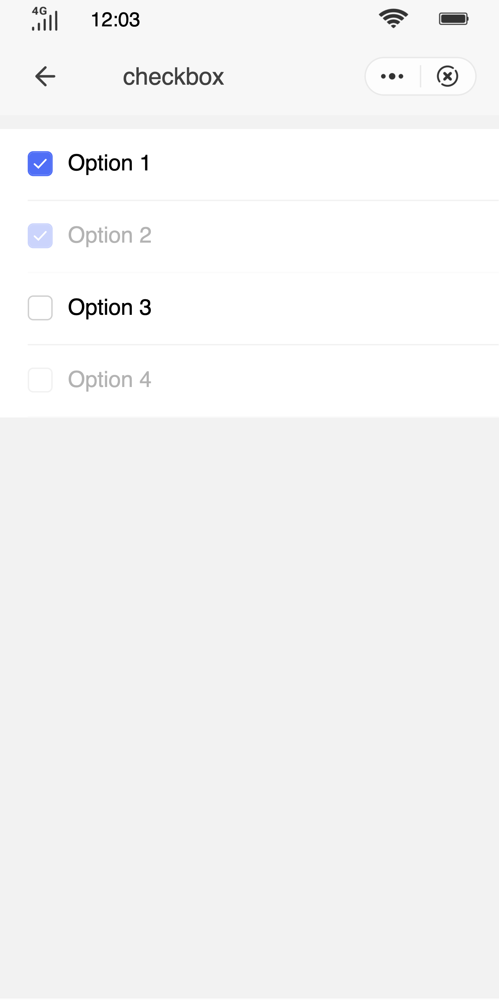

## Checkbox (`checkbox`)

### Description

Allows users to select multiple items in a form.

### Usage result

<!--div style="text-align: center;margin: 40px;"></div-->

<preview url="https://wonderful-harsh-alvarezsaurus.glitch.me/preview/pages/checkbox"/>

### How to use it

Importing a component in a `.ux` file:

```html
<import name="q-checkbox" src="qaui/src/components/checkbox/index"></import>
```

### Example

```html
<template>
  <div class="qaui-wrap">
    <q-checkbox-group
      id="myGroup"
      current="{{current}}"
      onchange="handleChange"
    >
      <q-checkbox
        group="myGroup"
        type="list"
        for="{{list}}"
        value="{{$item.value}}"
        checked="{{$item.checked}}"
        disabled="{{$item.disabled}}"
      ></q-checkbox>
    </q-checkbox-group>
  </div>
</template>
```

```js
export default {
  data() {
    return {
      list: [
        {
          id: 1,
          value: 'Option 1',
          checked: true,
        },
        {
          id: 2,
          value: 'Option 2',
          checked: true,
          disabled: true,
        },
        {
          id: 3,
          value: 'Option 3',
        },
        {
          id: 4,
          value: 'Option 4',
          disabled: true,
        },
      ],
      current: ['Option 2', 'Option 1'],
    }
  },
  handleChange({ detail }) {
    const index = this.current.indexOf(detail.value)
    index === -1
      ? this.current.push(detail.value)
      : this.current.splice(index, 1)
  },
}
```

```less
.qaui-wrap {
  flex-direction: column;
  align-items: center;
  background-color: #f2f2f2;
  padding: 10px 0;
}
```

### API

#### Component Properties

| Attribute  | Type    | Value by default | Description                                         |
| ---------- | ------- | ---------------- | --------------------------------------------------- |
| `checked`  | Boolean | `false`          | Whether it is selected or not                       |
| `disabled` | Boolean | `false`          | Disabled                                            |
| `value`    | String  | -                | The value of the option                             |
| `group`    | String  | -                | The `id` of the group to which the checkbox belongs |

#### Component Events

| Event name | Event description | Value returned                   |
| ---------- | ----------------- | -------------------------------- |
| `change`   | Change of value   | `{current:current, value:value}` |
