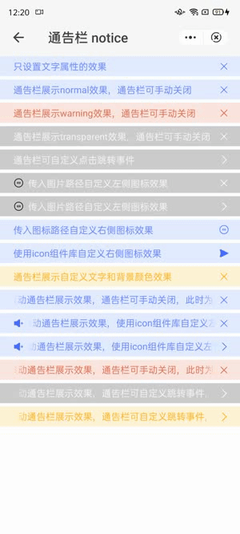

## Toast (`notice`)

### Description

Notification bar within the quick app, which can be used for static and dynamic notifications.

### Usage result

<div style="text-align: center;margin: 40px;"></div>

### How to use it

Importing a component in a `.ux` file:

```html
<import name="q-notice" src="qaui/src/components/notice/index"></import>
```

### Example

```html
<template>
  <div class="wrap">
    <div class="notice">
      <q-notice notice-text="{{ noticeTextArr[0] }}"></q-notice>
    </div>
    <div class="notice">
      <q-notice
        type="{{ typeArr[0] }}"
        notice-text="{{ noticeTextArr[1] }}"
        right-icon-type="{{ rightIconTypeArr[0] }}"
      ></q-notice>
    </div>
    <div class="notice">
      <q-notice
        type="{{ typeArr[1] }}"
        notice-text="{{ noticeTextArr[2] }}"
        right-icon-type="{{ rightIconTypeArr[0] }}"
      ></q-notice>
    </div>
    <div class="notice">
      <q-notice
        type="{{ typeArr[2] }}"
        notice-text="{{ noticeTextArr[3] }}"
        right-icon-type="{{ rightIconTypeArr[0] }}"
      ></q-notice>
    </div>
    <div class="notice">
      <q-notice
        type="{{ typeArr[2] }}"
        notice-text="{{ noticeTextArr[4] }}"
        right-icon-type="{{ rightIconTypeArr[1] }}"
        onlink-tap="linkTo"
      ></q-notice>
    </div>
    <div class="notice">
      <q-notice
        type="{{ typeArr[2] }}"
        notice-text="{{ noticeTextArr[5] }}"
        left-icon="{{ leftIcon1 }}"
        right-icon-type="{{ rightIconTypeArr[0] }}"
      ></q-notice>
    </div>
    <div class="notice">
      <q-notice
        type="{{ typeArr[2] }}"
        notice-text="{{ noticeTextArr[6] }}"
        left-icon="{{ leftIcon1 }}"
        right-icon-type="{{ rightIconTypeArr[1] }}"
        onlink-tap="linkTo"
      ></q-notice>
    </div>
    <div class="notice">
      <q-notice
        type="{{ typeArr[0] }}"
        notice-text="{{ noticeTextArr[7] }}"
        right-icon-type="{{ rightIconTypeArr[0] }}"
        right-icon="{{ rightIcon1 }}"
      ></q-notice>
    </div>
    <div class="notice">
      <q-notice
        type="{{ typeArr[0] }}"
        notice-text="{{ noticeTextArr[8] }}"
        right-icon-type="{{ rightIconTypeArr[1] }}"
        right-icon="{{ rightIcon2 }}"
        onlink-tap="linkTo"
      ></q-notice>
    </div>
    <div class="notice">
      <q-notice
        type="{{ typeArr[0] }}"
        notice-text="{{ noticeTextArr[9] }}"
        text-color="{{ textColor }}"
        bg-color="{{ bgColor }}"
        right-icon-type="{{ rightIconTypeArr[0] }}"
      ></q-notice>
    </div>
    <div class="notice">
      <q-notice
        type="{{ typeArr[0] }}"
        notice-text="{{ noticeTextArr[10] }}"
        right-icon-type="{{ rightIconTypeArr[0] }}"
        scrollable="{{ scrollable }}"
        scroll-times="{{ scrollTimes }}"
      ></q-notice>
    </div>
    <div class="notice">
      <q-notice
        type="{{ typeArr[0] }}"
        notice-text="{{ noticeTextArr[11] }}"
        left-icon="{{ leftIcon2 }}"
        right-icon-type="{{ rightIconTypeArr[0] }}"
        scrollable="{{ scrollable }}"
      ></q-notice>
    </div>
    <div class="notice">
      <q-notice
        type="{{ typeArr[0] }}"
        notice-text="{{ noticeTextArr[12] }}"
        left-icon="{{ leftIcon2 }}"
        right-icon-type="{{ rightIconTypeArr[1] }}"
        scrollable="{{ scrollable }}"
        speed="{{ speed }}"
        onlink-tap="linkTo"
      ></q-notice>
    </div>
    <div class="notice">
      <q-notice
        type="{{ typeArr[1] }}"
        notice-text="{{ noticeTextArr[13] }}"
        right-icon-type="{{ rightIconTypeArr[0] }}"
        scrollable="{{ scrollable }}"
      ></q-notice>
    </div>
    <div class="notice">
      <q-notice
        type="{{ typeArr[2] }}"
        notice-text="{{ noticeTextArr[14] }}"
        right-icon-type="{{ rightIconTypeArr[1] }}"
        scrollable="{{ scrollable }}"
        onlink-tap="linkTo"
      ></q-notice>
    </div>
    <div class="notice">
      <q-notice
        text-color="{{ textColor }}"
        bg-color="{{ bgColor }}"
        notice-text="{{ noticeTextArr[15] }}"
        right-icon-type="{{ rightIconTypeArr[1] }}"
        scrollable="{{ scrollable }}"
        onlink-tap="linkTo"
      ></q-notice>
    </div>
  </div>
</template>
```

```js
import router from '@system.router'
export default {
  data() {
    return {
      noticeTextArr: [
        'Set text attributes only',
        'The notification bar displays the normal effect. The notification bar can be manually closed.',
        'The warning effect is displayed on the notification bar. The notification bar can be manually closed.',
        'The notification bar displays the transparent effect. The notification bar can be manually closed',
        'You can customize the click jump event in the notification bar.',
        'Input the image path to customize the left icon effect',
        'Input the image path to customize the left icon effect',
        'Input the icon path to customize the icon effect on the right.',
        'Use the icon component library to customize the icon effect on the right.',
        'The notification bar displays customized text and background color.',
        'The scrolling notice bar displays the effect. The notice bar can be manually closed. In this case, the playback is endlessly looped...',
        'The display effect of scrolling the notice bar is displayed. Use the icon library to customize the icon on the left. The notice bar can be manually closed. The default playback effect is used.',
        'Scroll the notice bar display effect. Use the icon library to customize the icon on the left. You can customize the jump event in the notice bar. In this case, you can customize the playback speed.',
        'The scrolling notice bar displays the effect. The notice bar can be manually closed. In this case, the playback effect is displayed when type is warning.',
        'The display effect of scrolling the notification bar is displayed. You can customize the jumping event in the notification bar. In this case, the playback effect is displayed when type is set to transparent.',
        'The display effect of scrolling the notice bar is displayed. You can customize the jumping event in the notice bar. In this case, you can customize the background color and text color.',
      ],
      typeArr: ['normal', 'warning', 'transparent'],
      textColor: '#ffa500',
      bgColor: '#fef3d5',
      leftIcon1: {
        iconPath: '/common/images/default_black.png',
      },
      leftIcon2: {
        icon: {
          type: 'volume-up-fill',
          color: '#456FFF',
        },
      },
      rightIconTypeArr: ['close', 'link'],
      rightIcon1: {
        iconPath: '/common/images/default_blue.png',
      },
      rightIcon2: {
        icon: {
          type: 'send-fill',
          color: '#456FFF',
        },
      },
      scrollable: true,
      speed: 60,
      scrollTimes: -1,
    }
  },
  linkTo(data) {
    const event = data.detail.event
    console.log(event)
    router.push({
      uri: '/pages/button',
    })
  },
}
```

```less
.wrap {
  flex-direction: column;

  .notice {
    margin-bottom: 5px;
  }
}
```

### API

#### Component Properties

| Attribute       | Type    | Value by default | Description                                                                                                                                                              |
| --------------- | ------- | ---------------- | ------------------------------------------------------------------------------------------------------------------------------------------------------------------------ |
| `type`          | String  | `'normal'`       | Notification type. The options are: `'normal'` \| `'warning'` \| `'transparent'`                                                                                         |
| `noticeText`    | String  | `''`             | Notification text                                                                                                                                                        |
| `textColor`     | String  | `''`             | Text color of the notification bar                                                                                                                                       |
| `bgColor`       | String  | `''`             | Background color of the notification bar. Instead of using rgba, is recommended using the hexadecimal value obtained by multiplying the text color by 0.15 transparency. |
| `leftIcon`      | Object  | `{}`             | Icon object on the left. For details, see the table below.                                                                                                               |
| `rightIconType` | String  | `'close'`        | Button icon on the right of the notification bar. The options are: `'close'` \| `'link'`                                                                                 |
| `rightIcon`     | Object  | `{}`             | Icon object on the right. For details, see the table below.                                                                                                              |
| `scrollable`    | Boolean | `false`          | Indicates if scroll is active or not.                                                                                                                                    |
| `speed`         | Number  | `20`             | Scrolling speed                                                                                                                                                          |
| `scrollTimes`   | Number  | `5`              | Number of scroll slots. If the value is -1, scrolling is infinite.                                                                                                       |

##### leftIcon、rightIcon Attributes

| Attribute  | Type   | Description                                                                                                               |
| ---------- | ------ | ------------------------------------------------------------------------------------------------------------------------- |
| `iconPath` | String | Icon path. (You only need to set either `iconPath` or `icon`. If both are set, `icon` has higher priority)                |
| `icon`     | Object | Configuration item of the icon component in the library. Currently, only the `type` and `color` attributes are supported. |

#### Component Events

| Event name | Event description                                       | Value returned |
| ---------- | ------------------------------------------------------- | -------------- |
| `linkTap`  | Click triggered when `rightIconType` is set to `'link'` | `event`        |
