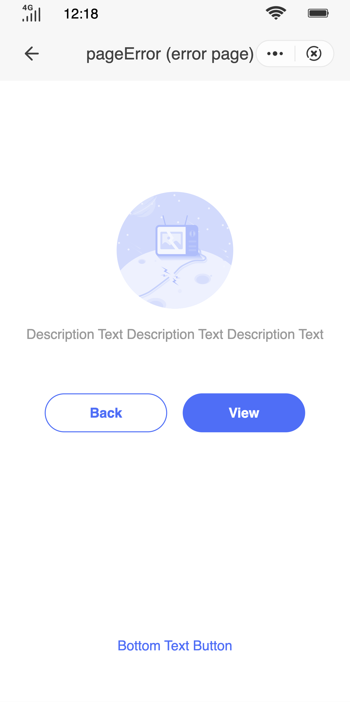

## Error Page (`page-error`)

### Description

This page is used to display and report unusual behavior of the system and exceptions.

### Usage result

<div style="text-align: center;margin: 40px;"></div>

### How to use it

Importing a component in a `.ux` file:

```html
<import name="q-page-error" src="qaui/src/components/page-error/index"></import>
```

### Example

```html
<template>
  <div class="wrap">
    <q-page-error
      type="{{ typesArr[0] }}"
      left-btn-name="{{ leftBtnName }}"
      right-btn-name="{{ rightBtnName }}"
      description="{{ description }}"
      footer-btn-text="{{ footerBtnText }}"
      onleft-btn-tap="leftBtn"
      onright-btn-tap="rightBtn"
      onfooter-btn-tap="footerBtn"
    ></q-page-error>
  </div>
</template>
```

```js
import router from '@system.router'
export default {
  data() {
    return {
      typesArr: [
        'certificate_expires',
        'network_anomaly',
        'not_found',
        'page_error',
        'quick_app_not_online',
        'quick_app_offline',
        'version_too_low',
      ],
      leftBtnName: 'Back',
      rightBtnName: 'View',
      description: 'Description Text Description Text Description Text',
      footerBtnText: 'Bottom Text Button',
    }
  },
  leftBtn(data) {
    const event = data.detail.event
    console.log(event)
    router.back()
  },
  rightBtn(data) {
    const event = data.detail.event
    console.log(event)
    router.push({
      uri: '/pages/button',
    })
  },
  footerBtn(data) {
    const event = data.detail.event
    console.log(event)
    router.push({
      uri: '/pages/footer',
    })
  },
}
```

```less
.wrap {
  width: 100%;
  height: 100%;
}
```

### API

#### Component Properties

| Attribute       | Type   | Value by default | Description                                                                                                                                                                                                                            |
| --------------- | ------ | ---------------- | -------------------------------------------------------------------------------------------------------------------------------------------------------------------------------------------------------------------------------------- |
| `type`          | String | `'page_error'`   | Default type (each type has default graphics and text). The options are: `'page_error'` \| `'network_anomaly'` \| `'version_too_low'` \| `'not_found'` \| `'quick_app_offline'` \| `'quick_app_not_online'` \| `'certificate_expires'` |
| `image`         | String | `''`             | Error image                                                                                                                                                                                                                            |
| `leftBtnName`   | String | `''`             | Label of button on the left                                                                                                                                                                                                            |
| `rightBtnName`  | String | `''`             | Label of button on the right                                                                                                                                                                                                           |
| `description`   | String | `''`             | Error description                                                                                                                                                                                                                      |
| `footerBtnText` | String | `''`             | Label of button at the bottom                                                                                                                                                                                                          |

#### Component Events

| Event name     | Event description                | Value returned |
| -------------- | -------------------------------- | -------------- |
| `leftBtnTap`   | Clicked the button on the left   | `event`        |
| `rightBtnTap`  | Clicked the button on the right  | `event`        |
| `footerBtnTap` | Clicked the button at the bottom | `event`        |
