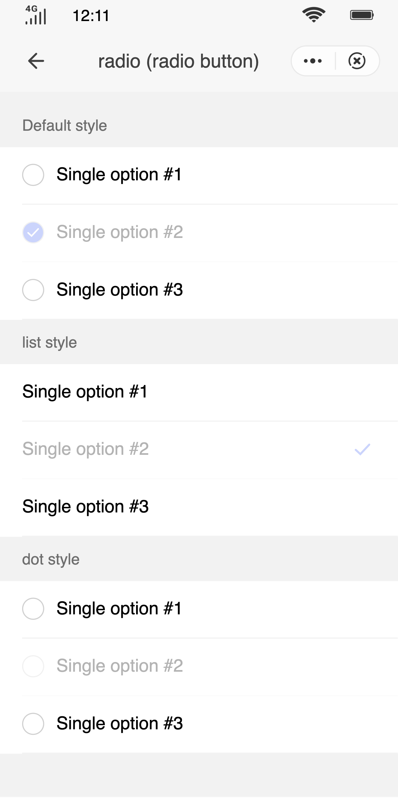

## Radio Button (`radio`)

### Description

Used to allow users to select a single item of information in a form.

### Usage result

<!--div style="text-align: center;margin: 40px;"></div-->

<preview url="https://quick-app-ui.glitch.me/preview/pages/radio/"/>

### How to use it

Importing a component in a `.ux` file:

```html
<import name="q-radio" src="qaui/src/components/radio/index"></import>
```

### Example

```html
<template>
  <div class="qaui-wrap">
    <text class="title">Default style</text>
    <q-radio-group id="myGroup1" current="{{current}}" onchange="handleChange">
      <q-radio
        group="myGroup1"
        for="{{list}}"
        value="{{$item.value}}"
        checked="{{$item.checked}}"
      ></q-radio>
    </q-radio-group>
    <text class="title">list style</text>
    <q-radio-group id="myGroup2" current="{{current}}" onchange="handleChange">
      <q-radio
        group="myGroup2"
        type="list"
        for="{{list}}"
        value="{{$item.value}}"
        checked="{{$item.checked}}"
      ></q-radio>
    </q-radio-group>
    <text class="title">dot style</text>
    <q-radio-group id="myGroup3" current="{{current}}" onchange="handleChange">
      <q-radio
        group="myGroup3"
        type="dot"
        for="{{list}}"
        value="{{$item.value}}"
        checked="{{$item.checked}}"
      ></q-radio>
    </q-radio-group>
  </div>
</template>
```

```js
export default {
  data() {
    return {
      list: [
        {
          id: 1,
          value: 'Single option #1',
        },
        {
          id: 2,
          value: 'Single option #2',
          checked: true,
        },
        {
          id: 3,
          value: 'Single option #3',
        },
      ],
      current: 'Single option #2',
    }
  },
  handleChange({ detail }) {
    this.current = detail.value
  },
}
```

```less
.qaui-wrap {
  flex-direction: column;
  align-items: center;
  background-color: #f2f2f2;
  padding: 10px 0;
  .title {
    height: 40px;
    font-size: 14px;
    align-self: flex-start;
    padding-left: 20px;
  }
}
```

### API

#### Component Properties

| Attribute  | Type    | Value by default | Description                                                         |
| ---------- | ------- | ---------------- | ------------------------------------------------------------------- |
| `checked`  | Boolean | `false`          | Whether it is selected or not                                       |
| `disabled` | Boolean | `false`          | Disabled                                                            |
| `type`     | String  | `'default'`      | Optional selector style. Values are: `'default'`\|`'list'`\|`'dot'` |
| `value`    | String  | -                | The value of the option                                             |
| `group`    | String  | -                | Indicates the `id` of the group to which the radio box belongs.     |

#### Component Events

| Event name | Event description   | Value returned                   |
| ---------- | ------------------- | -------------------------------- |
| `change`   | Change of the value | `{current:current, value:value}` |
