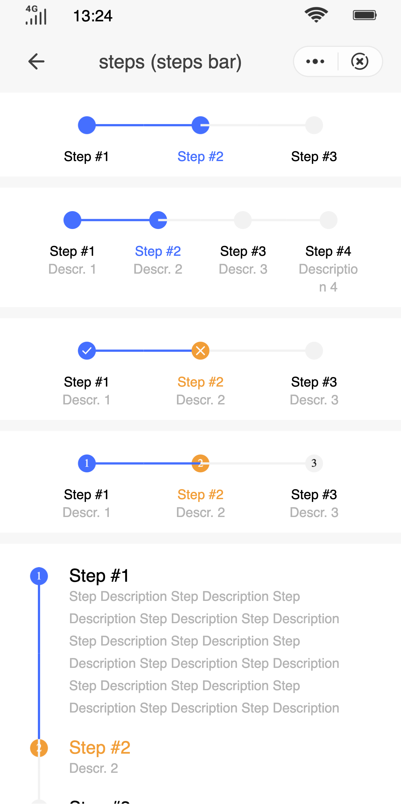

## Steps Bar (`steps`)

### Description

Shows the progress in a process with different stages.

### Usage result

<!-- div style="text-align: center;margin: 40px;"></div -->

<preview url="https://quick-app-ui.glitch.me/preview/pages/steps/"/>

### How to use it

Importing a component in a `.ux` file:

```html
<import name="q-steps" src="qaui/src/components/steps/index"></import>
<import name="q-step" src="qaui/src/components/step/index"></import>
```

### Example

```html
<template>
  <div class="qaui-steps">
    <div class="qaui-steps-wrapper">
      <q-steps direction="row" id="11" current="{{1}}">
        <q-step title="Step #1" group-id="11"></q-step>
        <q-step title="Step #2" group-id="11"></q-step>
        <q-step title="Step #3" group-id="11"></q-step>
      </q-steps>
    </div>
    <div class="qaui-steps-wrapper">
      <q-steps direction="row" id="12" current="{{1}}">
        <q-step
          title="Step #1"
          group-id="12"
          content="Step 1 Description"
        ></q-step>
        <q-step
          title="Step #2"
          content="Step 2 Description"
          group-id="12"
        ></q-step>
        <q-step
          title="Step #3"
          content="Step 3 Description"
          group-id="12"
        ></q-step>
        <q-step
          title="Step #4"
          content="Step 4 Description"
          group-id="12"
        ></q-step>
      </q-steps>
    </div>
    <div class="qaui-steps-wrapper">
      <q-steps direction="row" id="16" current="{{1}}" has-icon="{{true}}">
        <q-step
          title="Step #1"
          group-id="16"
          content="Step 1 Description"
        ></q-step>
        <q-step
          title="Step #2"
          group-id="16"
          content="Step Description"
          status="error"
        ></q-step>
        <q-step
          title="Step #3"
          group-id="16"
          content="Step 3 Description"
        ></q-step>
      </q-steps>
    </div>
    <div class="qaui-steps-wrapper">
      <q-steps direction="row" id="17" current="{{1}}" has-text="{{true}}">
        <q-step
          title="Step #1"
          group-id="17"
          content="Step 1 Description"
        ></q-step>
        <q-step
          title="Step #2"
          group-id="17"
          content="Step 2 Description"
          status="error"
        ></q-step>
        <q-step
          title="Step #3"
          group-id="17"
          content="Step 3 Description"
        ></q-step>
      </q-steps>
    </div>
    <div class="qaui-steps-wrapper">
      <q-steps direction="column" id="13" current="{{1}}" has-text="{{true}}">
        <q-step
          title="Step #1"
          content="Step Description Step Description Step Description Step Description Step Description Step Description Step Description Step Description Step Description Step Description Step Description Step Description Step Description Step Description Step Description"
          group-id="13"
        ></q-step>
        <q-step
          title="Step #2"
          content="Step Description"
          group-id="13"
          status="error"
        ></q-step>
        <q-step
          title="Step #3"
          content="Step 3 Description"
          group-id="13"
        ></q-step>
        <q-step
          title="Step #4"
          content="Step 4 Description"
          group-id="13"
        ></q-step>
      </q-steps>
    </div>
    <div class="qaui-steps-wrapper">
      <q-steps direction="column" id="18" current="{{1}}" has-icon="{{true}}">
        <q-step
          title="Step #1"
          content="Step Description Step Description Step Description Step Description Step Description Step Description Step Description Step Description Step Description Step Description Step Description Step Description Step Description Step Description Step Description"
          group-id="18"
        ></q-step>
        <q-step
          title="Step #2"
          content="Step Description"
          group-id="18"
          status="error"
        ></q-step>
        <q-step
          title="Step #3"
          content="Step 3 Description"
          group-id="18"
        ></q-step>
        <q-step
          title="Step #4"
          content="Step 4 Description"
          group-id="18"
        ></q-step>
      </q-steps>
    </div>
    <div class="qaui-steps-wrapper">
      <q-steps
        direction="column"
        id="14"
        error-color="#FF0000"
        finished-color="#00FF80"
        current="{{1}}"
      >
        <q-step
          title="Custom Color"
          content="Step Description Step Description Step Description Step Description Step Description Step Description Step Description Step Description Step Description Step Description Step Description Step Description Step Description Step Description Step Description"
          group-id="14"
        ></q-step>
        <q-step
          title="Step #2"
          icon="close"
          content="Step Description"
          group-id="14"
          status="error"
        ></q-step>
        <q-step
          title="Step #3"
          content="Step 3 Description"
          group-id="14"
        ></q-step>
        <q-step
          title="Step #4"
          content="Step 4 Description"
          group-id="14"
        ></q-step>
      </q-steps>
    </div>
    <div class="qaui-steps-wrapper">
      <q-steps
        direction="column"
        id="15"
        error-color="#FF0000"
        finished-color="#00FF80"
        current="{{ current }}"
      >
        <q-step
          title="Step #1"
          content="Step Description Step Description Step Description Step Description Step Description Step Description Step Description Step Description Step Description Step Description Step Description Step Description Step Description Step Description Step Description"
          group-id="15"
        ></q-step>
        <q-step
          title="Step #2"
          content="Step Description"
          group-id="15"
        ></q-step>
        <q-step
          title="Step #3"
          content="Step 3 Description"
          group-id="15"
        ></q-step>
        <q-step
          title="Step #4"
          content="Step 4 Description"
          group-id="15"
        ></q-step>
      </q-steps>
    </div>
    <div class="qaui-steps-button">
      <q-button class="button" type="ghost" ontap="changeStatus"
        >Next Step</q-button
      >
    </div>
  </div>
</template>
```

```js
export default {
  data() {
    return {
      current: 0,
    }
  },

  changeStatus() {
    this.current = this.current + 1
  },
}
```

```less
.qaui-steps {
  background-color: #f7f7f7;
  flex-direction: column;

  &-wrapper {
    background-color: #ffffff;
    padding-bottom: 10px;
    margin-bottom: 10px;
  }

  &-button {
    align-self: center;
    margin-bottom: 10px;
  }
}
```

### steps Component Properties

| Attribute       | Type    | Value by default | Description                                                                                                    |
| --------------- | ------- | ---------------- | -------------------------------------------------------------------------------------------------------------- |
| `current`       | Number  | `0`              | Current step, starting from `0`                                                                                |
| `direction`     | String  | `'horizontal'`   | Arrangement mode. The options are: `'vertical'` \|`'horizontal'`                                               |
| `id`            | String  | `''`             | ID (mandatory). When multiple steps components are used at the same time, the IDs of the steps must be unique. |
| `hasText`       | Boolean | `false`          | Indicates whether to display integers in the default style.                                                    |
| `hasIcon`       | Boolean | `false`          | Indicates if the step has `icon`                                                                               |
| `finishedColor` | String  | `#456FFF`        | Customized color of the `finished` status                                                                      |
| `errorColor`    | String  | `#F19E38`        | Customized color of the `error` status                                                                         |

### step Component Properties

| Attribute | Type   | Value by default | Description                                                                       |
| --------- | ------ | ---------------- | --------------------------------------------------------------------------------- |
| `status`  | String | `'waiting'`      | Current status of a step: `'waiting'` \| `'proceed'` \| `'finished'` \| `'error'` |
| `icon`    | String | `''`             | Style of the icon. For more details see the `icon` component.                     |
| `groupId` | String | `''`             | ID of the parent component (mandatory).                                           |
| `title`   | String | `''`             | Custom title                                                                      |
| `content` | String | `''`             | Custom content                                                                    |
