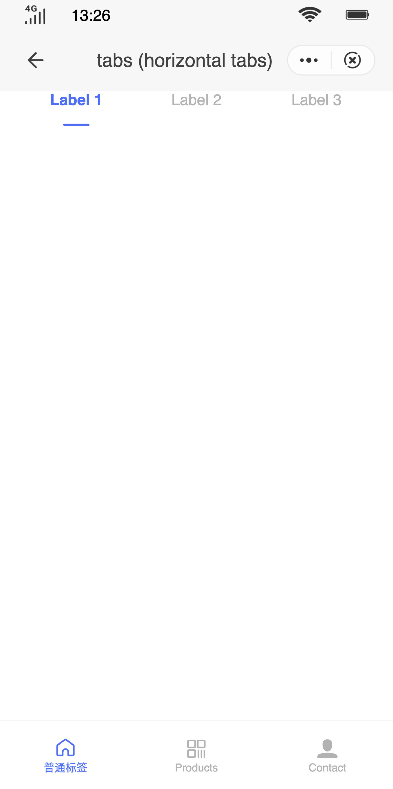

## Horizontal Tabs (`tabs`)

### Description

Tabs (in the same row) to switch actions and access different pages.

### Usage result

<!-- div style="text-align: center;margin: 40px;">
    
</div -->

<preview url="https://quick-app-ui.glitch.me/preview/pages/tabs/"/>

### How to use it

Importing a component in a `.ux` file:

```html
<import name="q-tabbar" src="qaui/src/components/tabbar/index"></import>
<import name="q-tabs" src="qaui/src/components/tabs/index"></import>
```

### Example

```html
<template>
  <div class="qaui-wrap">
    <q-tabbar
      index="{{ index }}"
      background="{{ background }}"
      text-color="{{ textColor }}"
      active-color="{{ activeColor }}"
      data="{{ tabbarData }}"
      icon-size="{{ iconSize }}"
      ontap="changeTabbar"
    >
      <div class="item-container">
        <q-tabs
          index="0"
          type="default"
          class="q-tabs"
          data="{{ dataDefault1 }}"
          active-color="#456fff"
          background="#FFF"
          active-background="#FFF"
          ontap="tap"
        >
          <block for="{{ dataDefault1 }}">
            <div class="item-content">
              <text>Tab#{{ $idx + 1 }} Content</text>
            </div>
          </block>
        </q-tabs>
        <q-tabs
          index="0"
          type="default"
          class="q-tabs"
          data="{{ dataDefault2 }}"
          active-color="#456fff"
          background="#FFF"
          active-background="#FFF"
          ontap="tap"
        >
          <block for="{{ dataDefault2 }}">
            <div class="item-content">
              <text>Tab#{{ $idx + 1 }} Content</text>
            </div>
          </block>
        </q-tabs>
        <q-tabs
          index="0"
          type="default"
          class="q-tabs"
          data="{{ dataDefault3 }}"
          active-color="#456fff"
          background="#FFF"
          active-background="#FFF"
          ontap="tap"
        >
          <block for="{{ dataDefault3 }}">
            <div class="item-content">
              <text>Tab#{{ $idx + 1 }} Content</text>
            </div>
          </block>
        </q-tabs>
        <q-tabs
          index="0"
          type="default"
          class="q-tabs"
          data="{{ dataDefault4 }}"
          active-color="#456fff"
          background="#FFF"
          active-background="#FFF"
          ontap="tap"
        >
          <block for="{{ dataDefault4 }}">
            <div class="item-content">
              <text>Tab#{{ $idx + 1 }} Content</text>
            </div>
          </block>
        </q-tabs>
      </div>
      <div class="item-container">
        <q-tabs
          index="0"
          type="capsule"
          class="q-tabs"
          data="{{ dataDefault1 }}"
          active-color="#fff"
          background="#b3b3b3"
          active-background="#456fff"
          ontap="tap"
        >
          <block for="{{ dataDefault1 }}">
            <div class="item-content">
              <text>Tab#{{ $idx + 1 }} Content</text>
            </div>
          </block>
        </q-tabs>
        <q-tabs
          index="0"
          type="capsule"
          class="q-tabs"
          data="{{ dataDefault2 }}"
          active-color="#fff"
          background="#b3b3b3"
          active-background="#456fff"
          ontap="tap"
        >
          <block for="{{ dataDefault2 }}">
            <div class="item-content">
              <text>Tab#{{ $idx + 1 }} Content</text>
            </div>
          </block>
        </q-tabs>
        <q-tabs
          index="0"
          type="capsule"
          class="q-tabs"
          data="{{ dataDefault3 }}"
          active-color="#fff"
          background="#b3b3b3"
          active-background="#456fff"
          ontap="tap"
        >
          <block for="{{ dataDefault3 }}">
            <div class="item-content">
              <text>Tab#{{ $idx + 1 }} Content</text>
            </div>
          </block>
        </q-tabs>
      </div>
      <div class="item-container">
        <q-tabs
          index="0"
          type="desc"
          class="q-tabs"
          data="{{ dataDefault1 }}"
          active-color="#456fff"
          active-background="#456fff"
          ontap="tap"
        >
          <block for="{{ dataDefault1 }}">
            <div class="item-content">
              <text>Tab#{{ $idx + 1 }} Content</text>
            </div>
          </block>
        </q-tabs>
        <q-tabs
          index="0"
          type="desc"
          class="q-tabs"
          data="{{ dataDefault2 }}"
          active-color="#456fff"
          active-background="#456fff"
          ontap="tap"
        >
          <block for="{{ dataDefault2 }}">
            <div class="item-content">
              <text>Tab#{{ $idx + 1 }} Content</text>
            </div>
          </block>
        </q-tabs>
        <q-tabs
          index="0"
          type="desc"
          class="q-tabs"
          data="{{ dataDefault3 }}"
          active-color="#456fff"
          active-background="#456fff"
          ontap="tap"
        >
          <block for="{{ dataDefault3 }}">
            <div class="item-content">
              <text>Tab#{{ $idx + 1 }} Content</text>
            </div>
          </block>
        </q-tabs>
        <q-tabs
          index="0"
          type="desc"
          class="q-tabs"
          data="{{ dataDefault4 }}"
          active-color="#456fff"
          active-background="#456fff"
          ontap="tap"
        >
          <block for="{{ dataDefault4 }}">
            <div class="item-content">
              <text>Tab#{{ $idx + 1 }} Content</text>
            </div>
          </block>
        </q-tabs>
      </div>
    </q-tabbar>
  </div>
</template>
```

```less
<style lang="less">
.qaui-wrap {
  flex-direction: column;
}

.item-container {
  flex-direction: column;
  justify-content: flex-start;
  height: 100px;
}
.item-content {
  flex-direction: column;
  text {
    color: red;
    font-size: 14px;
  }
}
</style>
```

```js
<script>
export default {
  data() {
    return {
      dataDefault1: [
        { label: 'Label 1', describe: 'Descr. 1' },
        { label: 'Label 2', describe: 'Descr. 2' }],
      dataDefault2: [
        { label: 'Label 1', describe: 'Descr. 1' },
        { label: 'Label 2', describe: 'Descr. 2' },
        { label: 'Label 3', describe: 'Descr. 3' }],
      dataDefault3: [
        { label: 'Label 1', describe: 'Descr. 1' },
        { label: 'Label 2', describe: 'Descr. 2' },
        { label: 'Label 3', describe: 'Descr. 3' },
        { label: 'Label 4', describe: 'Description 4' }],
      dataDefault4: [
        { label: 'Label 1', describe: 'Descr. 1' },
        { label: 'Label 2', describe: 'Descr. 2' },
        { label: 'Label 3', describe: 'Descr. 3' },
        { label: 'Label 4', describe: 'Description 4' },
        { label: 'Label 5', describe: 'Description 5' }],
      tabbarData: [
        {
          icon: 'homepage',
          iconPath: '../../common/images/tabIcon.svg',
          selectedIconPath: '../../common/images/tabSelectIcon.svg',
          text: 'Home',
        },
        {
          icon: 'qrcode',
          iconPath: '../../common/images/tabIcon.svg',
          selectedIconPath: '../../common/images/tabSelectIcon.svg',
          text: 'Products',
        },
        {
          icon: 'contact-fill',
          iconPath: '../../common/images/tabIcon.svg',
          selectedIconPath: '../../common/images/tabSelectIcon.svg',
          text: 'Contact',
        },
      ],
      index: 0,
      iconSize: 22,
      background: '#fff',
      activeColor: '#456FFF',
      textColor: '#B2B2B2',

    }
  },
  tap(evt) {
    console.log(evt.detail)
  },
  changeTabbar(evt) {
    console.log('changeTabbar', evt.detail)
  }
}
</script>
```

### Component Properties

| Attribute          | Type   | Value by default | Description                                                                                                      |
| ------------------ | ------ | ---------------- | ---------------------------------------------------------------------------------------------------------------- |
| `index`            | String | `'0'`            | Index of the selected label. The default value is `0`.                                                           |
| `type`             | String | `'default'`      | Tag type (mandatory). The options are `default`, `capsule`, and `desc`.                                          |
| `activeColor`      | String | `'#456FFF'`      | Text color of the active label                                                                                   |
| `background`       | String | `'#fff'`         | Label background color                                                                                           |
| `activeBackground` | String | `'#fff'`         | Background color of the active label. (When `type=desc` this refers to the background color of the description.) |
| `data`             | Array  | `[ ]`            | Array of data objects. The object data structure is defined in the following table.                              |

#### `data` Object Attributes

| Attribute  | Type   | Value by default | Description                                                                                  |
| :--------- | :----- | :--------------- | :------------------------------------------------------------------------------------------- |
| `label`    | String | -                | Label content (mandatory)                                                                    |
| `describe` | String | -                | Description text of the label. This parameter is valid only when `type` is set to `capsule`. |

### Component Events

| Event name | Event description | Value returned                                  |
| ---------- | ----------------- | ----------------------------------------------- |
| `tap`      | Tab is switched   | `{detail: {index: Index of the current click}}` |
