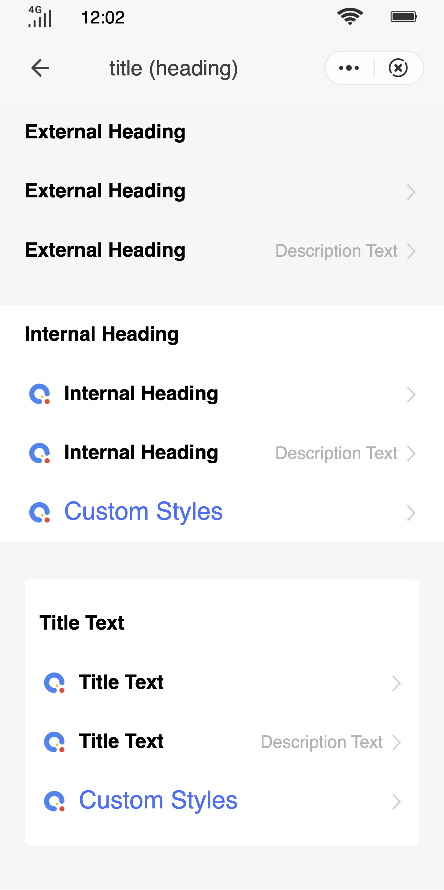

## Heading (`title`)

### Description

It is used to display headings at different levels.

### Usage result

<!-- div style="text-align: center;margin: 40px;"></div -->

<preview url="https://wonderful-harsh-alvarezsaurus.glitch.me/preview/pages/title/"/>

### How to use it

Importing a component in a `.ux` file:

```html
<import name="q-titlebar" src="qaui/src/components/title/index"></import>
```

### Example

```html
<div class="qaui-wrap">
  <div class="group">
    <q-title title="External Heading"></q-title>
    <q-title title="External Heading" target="/pages/home"></q-title>
    <q-title
      title="External Heading"
      description="Description Text"
      target="/pages/home"
    ></q-title>
  </div>
  <div class="group bg-white">
    <q-title title="Internal Heading"></q-title>
    <q-title
      icon="/common/logo.png"
      title="Internal Heading"
      target="/pages/home"
    ></q-title>
    <q-title
      icon="/common/logo.png"
      title="Internal Heading"
      description="Description Text"
      target="/pages/home"
    ></q-title>
    <q-title icon="/common/logo.png" target="/pages/home"
      ><text class="custom"></text
    ></q-title>
  </div>
  <q-container flex-direction="column">
    <q-title title="Title Text"></q-title>
    <q-title
      icon="/common/logo.png"
      title="Title Text"
      target="/pages/home"
    ></q-title>
    <q-title
      icon="/common/logo.png"
      title="Title Text"
      description="Description Text"
      target="/pages/home"
    ></q-title>
    <q-title icon="/common/logo.png" target="/pages/home"
      ><text class="custom">Custom Styles</text></q-title
    >
  </q-container>
</div>
```

```less
.qaui-wrap {
  background-color: #f6f6f6;
  flex-direction: column;
  .group {
    flex-direction: column;
    padding: 0 20px;
    margin-bottom: 20px;
  }
  .bg-white {
    background-color: #ffffff;
  }
  .custom {
    color: #456fff;
    font-size: 20px;
  }
}
```

### API

#### Component Properties

| Attribute     | Type   | Value by default | Description                      |
| ------------- | ------ | ---------------- | -------------------------------- |
| `title`       | String | `''`             | Title text                       |
| `icon`        | String | `''`             | URL or relative path of the icon |
| `description` | String | `''`             | Descriptive text                 |
| `target`      | String | `''`             | Redirection path                 |

#### slot

| Name | Description  |
| ---- | ------------ |
| -    | Custom Title |
