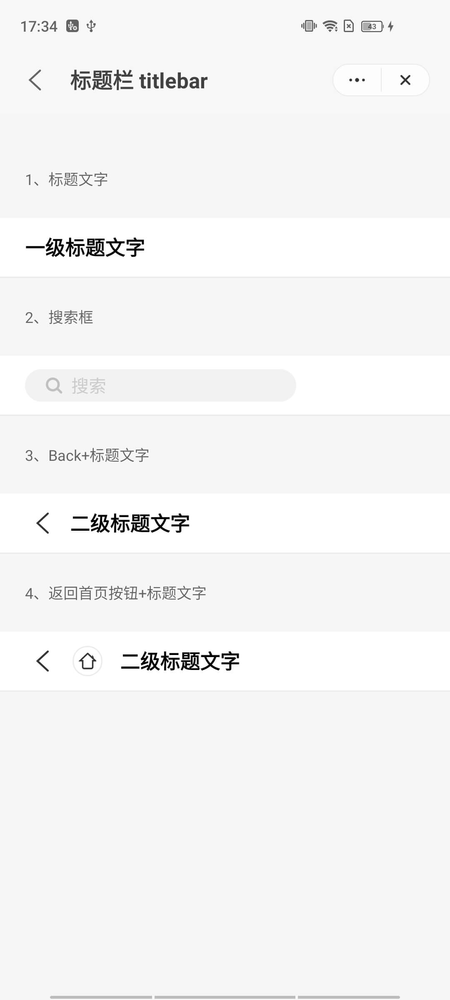

## Title Bar (`titleBar`)

### Description

Displays the page title.

### Usage result

<div style="text-align: center;margin: 40px;"></div>

### How to use it

Importing a component in a `.ux` file:

```html
<import name="q-titlebar" src="qaui/src/components/titlebar/index"></import>
```

### Example

```html
<template>
  <div class="qaui-wrap">
    <text class="title">1. Title text</text>
    <q-titlebar title="Level-1 Title Text"></q-titlebar>
    <text class="title">2. Search box</text>
    <q-titlebar
      title="Level-1 Title Text"
      search="/pages/searchbar"
    ></q-titlebar>
    <text class="title">3. Back + title text</text>
    <q-titlebar back="true" title="Secondary Title Text"></q-titlebar>
    <text class="title">4. Return to the home page + title text</text>
    <q-titlebar
      back="true"
      home="/pages/home"
      title="Secondary Title Text"
    ></q-titlebar>
  </div>
</template>
```

```less
.qaui-wrap {
  background-color: #f6f6f6;
  padding: 20px 0;
  flex-direction: column;
  .title {
    opacity: 0.6;
    font-size: 12px;
    color: #000000;
    line-height: 30px;
    padding: 15px 20px;
  }
}
```

### API

#### Component Properties

| Attribute     | Type    | Value by default | Description                       |
| ------------- | ------- | ---------------- | --------------------------------- |
| `title`       | String  | `''`             | Title text                        |
| `home`        | String  | `''`             | Home page routing path            |
| `back`        | Boolean | `false`          | Whether to display the return key |
| `search`      | String  | `''`             | Search page routing path          |
| `placeholder` | String  | `'Search'`       | Search input placeholder text     |
